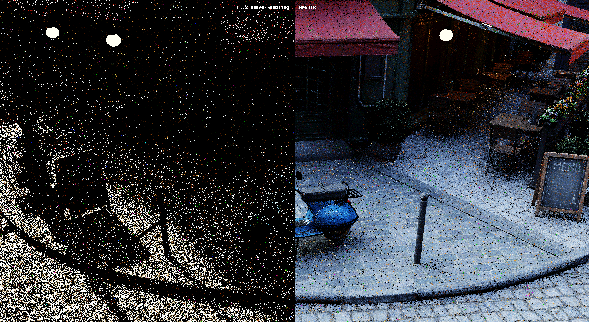

# ReSTIR Pass

  

a [Falcor](https://github.com/NVIDIAGameWorks/Falcor) render-pass for [ReSTIR](](https://research.nvidia.com/sites/default/files/pubs/2020-07_Spatiotemporal-reservoir-resampling/ReSTIR.pdf)) Based Direct Lighting.

## How to use

Add this project into the Falcor solution.  
  
After building this pass, you can load the render graph scripts under the project folder via Mogwai.  

## Limitations

> I only used Falcor Light Sampler, including a hierarchical environment map sampler(see [EnvMapSampler](https://github.com/NVIDIAGameWorks/Falcor/blob/5236495554f57a734cc815522d95ae9a7dfe458a/Source/Falcor/Experimental/Scene/Lights/EnvMapSampler.slang)) and an [Alias-Method](http://cgi.cs.mcgill.ca/~enewel3/posts/alias-method/index.html) power-based emissive triangle sampler(see [EmissivePowerSampler](https://github.com/NVIDIAGameWorks/Falcor/blob/5236495554f57a734cc815522d95ae9a7dfe458a/Source/Falcor/Experimental/Scene/Lights/EmissivePowerSampler.slang)). If you want to support more light types(such as point light, directional light) or more efficient light sampling techniques, you need to implement corresponding light samplers as initial sampling primitives.

> For simplicity, I used VBuffer instead of GBuffer, but VBuffer may lead to more computation overhead.

> I did not do tricks like Pre-Sampling, Decoupled Shading(see [HPG2021 Rearch ReSTIR](https://research.nvidia.com/publication/2021-07_Rearchitecting-Spatiotemporal-Resampling)). If you want to improve performance further, you need to implement this kind of thing by yourself.

> I only implemented spatial resampling de-bias. You need to implement temporal de-bias by yourself.